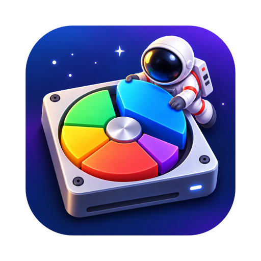
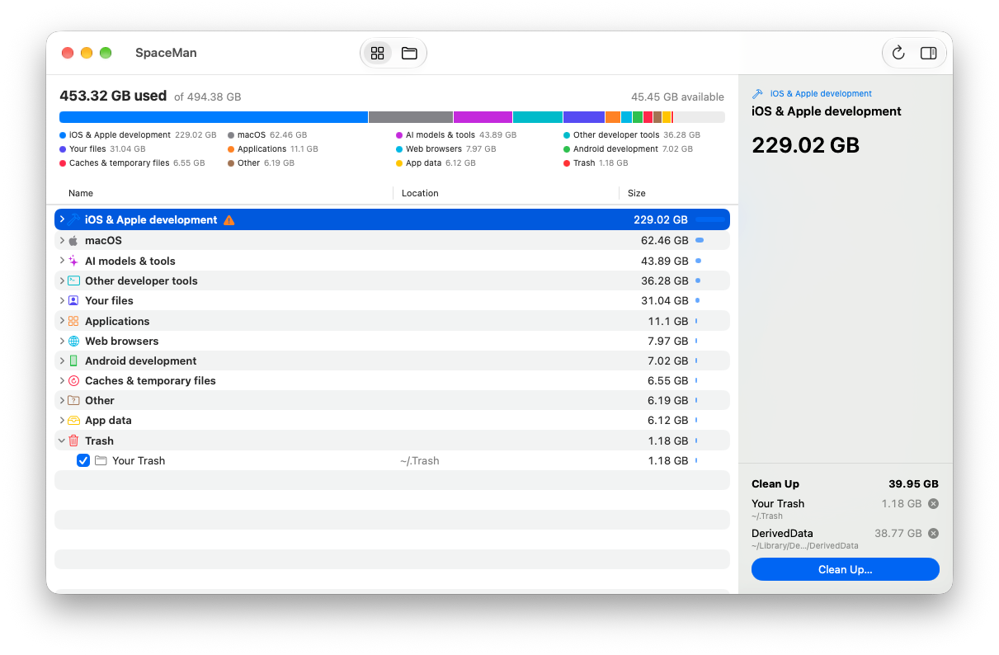

<p align="center">
  
</p>

<h1 align="center">SpaceMan</h1>

<p align="center">
  <strong>Find out what's eating your Mac's disk — by what it <em>is</em>, not where it hides.</strong><br>
  Simulator runtimes, DerivedData, AI models, package caches, forgotten VMs: named, sized and one tick away from gone.
</p>

<p align="center">
  
  
  
  <a href="LICENSE"></a>
</p>

<p align="center">
  
</p>

## Why

Developer tools scatter gigabytes across dozens of folders with opaque names. iOS development alone spreads over
simulator runtimes in `/System/Library/AssetsV2`, devices in `~/Library/Developer/CoreSimulator`, device support,
DerivedData, SwiftPM caches and several versioned Xcodes. A folder-size tool tells you `~/Library/Developer` is
80 GB; SpaceMan tells you *which* 80 GB, and what each piece is.

## Features

- **Grouped by concept.** Space is sorted into categories like *iOS & Apple development*, *AI models & tools*,
  *Other developer tools*, *Applications*, *Web browsers* and *macOS*, each broken down into the things inside it.
- **Friendly names from real metadata.** `af14d04f….asset` becomes *iOS 26.5 (23F77)*, a simulator's UUID folder
  becomes *iPhone 17 Pro · iOS 26.5*, and `MyApp-dptsbos…` in DerivedData becomes the project it was built from.
- **Knows what things are.** Select an item to see what it is and how to reclaim it safely.
- **Flags leftovers.** Simulator runtimes CoreSimulator no longer knows about, simulators whose runtime is gone,
  DerivedData for projects that no longer exist, caches built for a previous macOS.
- **Folders view.** Flip the toolbar switch to browse the same scan by location, with raw names alongside what
  SpaceMan identified each folder as.
- **Clean Up.** Tick items to build a list with a running total, then move them to the Trash or delete them
  outright. Only whole folders you can safely delete are selectable, and SpaceMan explains why when something
  isn't.
- **Honest totals.** Other APFS volumes, root-only simulator runtimes and space no folder accounts for (snapshots,
  purgeable data) are shown explicitly, so the numbers add up to what the disk reports.
- **Quick.** A full scan of a 450 GB disk holding 4.5 million files takes about 35 seconds.

## What it recognises

| Category | Examples |
| --- | --- |
| iOS & Apple development | Xcode installs, simulator runtimes and devices, device support, DerivedData, project `build`/`.build` folders, archives, SwiftPM and CocoaPods caches, CoreDevice data |
| AI models & tools | Claude desktop and Claude Code, ChatGPT and Codex, OpenCode, Ollama, LM Studio, Hugging Face models, Chrome's Gemini Nano, Apple Intelligence and Siri assets |
| Web development | npm, pnpm, Yarn, Bun, Deno, nvm, Composer, Herd, project `build` folders |
| Other developer tools | Homebrew, pip, uv, conda, Rust, Go, Ruby, Docker, VS Code, JetBrains |
| Android development | Android SDK, emulator images, Gradle caches, project `build` folders |
| Web browsers | Chrome, Firefox, Safari, Arc, Brave, Opera, Edge |
| Everything else | Applications, app containers, caches and temporary files, your files, iCloud Drive, device backups, Trash |

Project `build` folders are found at any depth in `~/Code`, `~/Projects` and `~/Developer`, sorted by the project
beside them, and only counted when git ignores them (so tracked folders, and ones inside ignored dependency folders
like `.venv/` or `vendor/`, are left alone).

Anything not in the catalogue still appears under **Other** as a folder hierarchy, so nothing large goes unseen.

## Getting started

Requires macOS 26 or later.

1. Open `SpaceMan.xcodeproj` in Xcode and run the **SpaceMan** scheme.
2. Grant **Full Disk Access** when SpaceMan asks on first launch (System Settings › Privacy & Security › Full Disk
   Access). It waits for access rather than scanning without it, since folders such as Mail, Messages and other
   apps' containers can't be measured otherwise.
3. Optionally grant **App Management** to delete other apps immediately rather than moving them to the Trash.

> [!NOTE]
> Build with an Xcode whose SDK matches the running macOS. A macOS 27.1 beta SDK build crashes in SwiftUI's state
> initialisation on macOS 27.0.

## How it works

1. **Scan.** A pool of threads walks the data volume with `getattrlistbulk`, counting allocated bytes (so sparse VM
   images report real usage) and hard links once. Only entries of 20 MB or more are kept in memory.
2. **Classify.** `Catalogue.swift` holds rules mapping path patterns to a category, a `Namer` that derives a
   friendly name from on-disk metadata, and a short description. The deepest matching rule wins, so a broad folder
   never hides the specific things inside it.
3. **Account for the rest.** Other APFS volumes come from `ATTR_VOL_SPACEUSED`, root-only simulator runtimes from
   `xcrun simctl`, and whatever's left of the data volume is shown as *Hidden from scan*.

### Teaching it about a new space hog

Add a `Rule` to `SpaceMan/Catalogue/Catalogue.swift`:

```swift
Rule(.aiTools, "Whisper", "~/.cache/whisper", "Whisper models",
     about: "Speech-recognition models downloaded by OpenAI's Whisper. Re-downloaded when needed.")
```

If the folder's name needs decoding, add a case to `Namer`.

## Distribution

Archive, then use Organizer › Distribute App › **Direct Distribution**, which signs with a Developer ID Application
certificate and notarises the app. Hardened Runtime is already enabled. The app is unsandboxed, as it needs to read
arbitrary paths.

Full Disk Access is tied to the code signature, which is why the project signs with a development team: an
ad-hoc-signed build loses the grant on every rebuild.

## Licence

SpaceMan is released under the [MIT licence](LICENSE). Copyright © 2026 Appoly Ltd.
